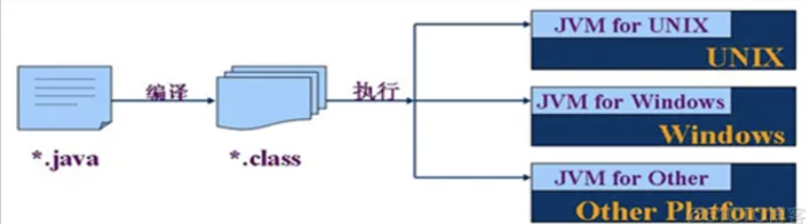

# java介绍

1. 爪哇 - 印度尼西亚的爪哇岛 - 盛产咖啡豆

2. 前身叫做Oak语言 - 橡树,这个商标被一家显卡制造商提前注册了.

3. Java之父 - James Gosling  - 詹姆斯 高斯林(搞死你)

4. 原先是属于SUN(太阳)公司 - 优先被IBM公司 - "讨好sun公司 - eclipse(免费) - 日食"

   `sun不乐意 - 打官司 - 打输了`

5. oracle公司[甲骨文] - 特殊的数据库产品[oracle] - 2019年以74亿美金收购的.

6. 官网:www.oracle.com

7. java语言是1995年5月23日正式诞生的.

# java的三个体系

1. javase(j2se) - java standard edition - java标准版 - 包含了java的基础语法 - 传统的适合桌面应用程序的开发.
2. javaee(j2ee) - 更名了 - Jakarta 雅加达EE .. java enterprise edition - java企业版
3. javame(j2me) - java micro edition - java微型版 - 适合移动端的开发 - "夭折了"

# java的特点

> 1. 简单易学
> 2. **跨(os)平台** - 可移植性 - 与平台无关性
> 3. 安全性 - 健壮性 => 不需要维护指针
> 4. 动态的语言 - **解释型的语言**
> 5. 多线程
> 6. 分布式

# jdk下载地址

> https://www.oracle.com/java/technologies/javase/jdk17-archive-downloads.html
>
> jdk的版本 -   jdk1.0 ....    **jdk5.0[巨变]** ...  jdk7.x[变化] -  **jdk8.x[目前最主流的]** .. jdk11.x ...   ***jdk17.x[趋势]***

> jdk - java development kit - java开发工具包 - 针对开发者使用的.

---

## jdk17环境变量配置

> 1. 解压到一个非中文的,不能带有特殊符号(比如空格)的目录.
>
> 2. 桌面 - 计算机 - 右击属性 - 高级系统设置 - 环境变量 - 定位到`系统变量`
>
>    * 新建
>
>      变量名 JAVA_HOME
>
>      变量值 /Users/admin/Downloads/jdk-17.0.6(`自己电脑的jdk解压之后的绝对路径`)
>
>    * 找到内置的系统变量 - Path - 点击编辑 - 点击新建
>
>      %JAVA_HOME%\bin
>
> 3. 点击 - 确定 - 关闭所有的设置窗口
>
> 4. 然后打开终端win+r - 输入cmd,`如果在进行环境变量设置之前,已经打开了终端,那么重启这个终端`
>
>    ~~~cmd
>    java -version
>       
>    java version "17.0.6" 2023-01-17 LTS
>    Java(TM) SE Runtime Environment (build 17.0.6+9-LTS-190)
>    Java HotSpot(TM) 64-Bit Server VM (build 17.0.6+9-LTS-190, mixed mode, sharing)
>    ~~~

---

# java的执行原理

> jdk的解压之后的bin目录 - .exe结尾的都是开发工具.比较重要的**javac.exe和java.exe**
>
> 1. javac.exe - 将java源代码**编译**成字节码文件
> 2. java.exe - **运行**这个字节码文件[运行java程序]

---

> 1. 在桌面 - 右击新建一个文件 - HelloWorld.java(类文件)
>
>    `确保计算机中的文件的后缀扩展名要显示的 - 磁盘 - 工具 - 扩展名打钩`
>
>    `否则可能创建出来的文件HelloWorld.java.txt文件`
>
> 2. 打开文件,进行编码
>
>    ~~~java
>    //单行注释 - 注释的代码是不会经过编译器进行编译的 => 程序员看的.
>    //public(公开的)和class(类)都是属于关键字 => 定义类
>    //此处的HelloWorld就是类名,类名必须和文件名高度保持一致.
>    public class HelloWorld{
>      //程序的主入口 - "大门"
>      // main方法 - "死记住语法"
>      public static void main(String[] args){
>      	//方法体 - 现阶段 - 写代码的地方
>        //在控制台输出一句话
>        
>        //注意:在整个编码环节中,所有的符号必须是英文模式下的.
>        //java代码一行结束之后必须使用;
>        System.out.println("HelloWorld!");
>      }
>    }
>    ~~~
>
> 3. 通过终端(win+r => cmd)进入到桌面
>
>    ~~~cmd
>    User/计算机名 - 用户的主目录
>       
>    C:\User\计算机名>cd Desktop
>       
>    ~~~

> 4. **编译**整个java源代码文件[以.java为后缀的文件]
>
>    ~~~cmd
>    C:\User\计算机名\Desktop>javac HelloWorld.java
>    ~~~
>
>    `效果:只要语法没有问题,就会编译生成一个.class的字节码文件`
>
> 5. 运行的字节码文件
>
>    ~~~cmd
>    C:\User\计算机名\Desktop>java HelloWorld
>    ~~~

---

总结: java程序的执行的基本原理:

1. 编写好程序之后,当执行javac.exe命令的时候,本质上是调用jdk中的编译器,将.java源代码文件编译成一个.class的字节码文件

   `为什么需要编译呢? - 因为计算机是不能够直接识别java语言编写的程序.`

2. 当执行java.exe命令的时候,本质上是调用jvm中的解释器,它会将.class字节码文件逐行翻译成机器语言.

   `jvm - java虚拟机 - 想象成是以.class字节码文件为指令的cpu`

## 基本原理图

 

1. .class字节码文件是在java虚拟机中执行的.
2. 一次编译,到处执行 - **跨(os)平台** - 可移植性 - 与平台无关性
3. JVM的位置在java语言开发好的应用程序与底层的os之间的那一层.  jvm安装在os上的.  正是因为有了jvm,所以java才具备跨平台性.
4. jvm是不跨平台的.

5. jvm类似于"翻译官的角色"

​				 java-app - 中国人说的话

|  胖翻译 (jvm)                            |毛翻译(jvm)

鬼子 (os)                                     老毛子(os)

6. 思考 - java到底是属于编译型语言,还是属于解释型语言,还是属于半编译半解释型语言? - **解释型**

   C语言是属于编译型语言 - 编译型的真正的含义: 将开发语言编写好的程序可以一次性直接编译成我们os能够识别的语言.

   比如c语言的开发的程序可以一次性直接编译成二进制可执行文件, 常见的.exe文件.

   C语言不跨平台 - 特点: 一次编写,到处运行.  

7. 为什么java的运行速度没有C快???

   * 每次执行java.exe命令的时候,都会对.class文件进行逐行翻译.
   * C是一次性编译ok,后面直接运行的程序.

   举例:  java执行 - 类似于 "点读笔",   C执行->一次翻译好了中文

# 类命名的规范

> 类是java的基本单元.
>
> 1. 必须要遵守的
>
>    * 类名只能由字母 or 数字 or 下划线 or $组成,但是不能由数字开头.
>
>    * 类名不能是java中的关键字(`关键字` - 某些含有语法含义的单词)
>
>      `if,for,byte,short,int,long ,float,double,char,enum...`
>
>    * 类名不能是java中内置的**对象类型**(比如System,String,Scanner,Date...)
>
>    * 类名同样不能是以下三个字面量,true,false,null
>
>    * 类名不能是java中的保留关键字goto
>
> 2. 推荐遵守
>
>    * 类名采用"大驼峰" - 首字母要大写,其余单词小写.如果类名由多个单词组成,每个单词的首字母都要大写.
>
>      比如HelloWorld,StudentSystem...
>
>    * 不推荐使用中文.防止出现中文乱码问题.
>
>    * 不能使用中文拼音
>
>    * 提倡见名知意 - 提高程序的可读性.

---

# jdk和jvm以及jre

> 三者之间的区别和联系

> 1. jvm - java virtual machine - java虚拟机 - 跨平台 - 本身就是C语言写的.
>
> 2. jre - Java Runtime Environment - java运行时环境,针对java程序的使用者来讲的.
>
>    如果仅仅只是想要运行一个java开发好的程序,那么只需要在计算机中安装jre即可.
>
>    jre包括一些核心的内库以及jvm,所以jre是包括jvm
>
>    jre = 核心内库 + jvm
>
> 3. jdk - java development kit - java开发工具包 - 包括一些开发工具javac.exe,java.exe,jar.exe,javadoc.exe,javap.exe等等
>
>    针对开发者使用的.jdk包括开发工具以及jre,所以jdk = 开发工具 + jre

---

# 包package

> 包对于类的作用就类似于文件夹对文件的作用 - 对类文件进行分类管理的.在磁盘中就是一个文件夹.
>
> 企业中对包的命名规范
>
> 1. 个人发布的,但是不是独立完成的.
>
>    indi.发布者名称.项目名称.模块名称
>
> 2. 个人发布 - 个人独立完成的
>
>    pers.个人名称.项目名称.模块名称
>
> 3. 个人完成 - 但是没有公开的
>
>    pri.个人名称.项目名称.模块名称
>
> 4. 团队项目
>
>    team.项目名称.模块名称
>
> 5. 公司项目 - 一般是采用公司域名倒置的写法.比如百度 - com.baidu.
>
>    tech.aistar

---

> 包的命名规范
>
> 1. 可以有数字或者字母开头
>
> 2. 可以由数字,字母,下划线还有$组成.
>
> 3. 不能是java中的关键字
>
> 4. 不能包含java单词.
>
> 5. 如果包名有多个层次,推荐采用小写字母,并且各个单词之间用.隔开.
>
> 6. 一旦有了包存在,那么类文件中的首行就会出现声明包的语句
>
>    ~~~java
>    package tech.aistar.day01;//must be first line
>    ~~~

# java中三种注释

> 1. 单行注释
>
>    ~~~java
>    // 解释单行的代码
>    ~~~
>
> 2. 多行注释
>
>    ~~~java
>    				 /*
>                多行注释
>                多行注释
>             */
>    ~~~
>
> 3. 文档注释 - 后期学习了javadoc.exe(生成我们的api文档) - 文档注释都是可以生效的.
>
>    1. 负责解释类的作用
>    2. 负责解释方法的作用
>
>    ~~~java
>    /**
>     * 本来用来演示: HelloWorld
>     *
>     * @author success
>     * @date 2023/7/17 14:31:25
>     */
>    ~~~

---

# 关于main方法中的虚拟机参数

~~~java
 public static void main(String[] args) {
 		for(int i = 0;i<args.length;i++){
      System.out.println(args[i]);
    }
 }
~~~

正常编译javac HelloWorld.java

运行并且进行传参java Hello 我们 123 abc

# 数据类型

> **java中是采用数据类型和变量来定义和存储数据的**.`并且所有的基本类型都是存在在jvm内存的栈区`
>
> `栈区特点 - 先进后出 - 读写速度比较快`
>
> `速度快的本质 - java是一门强类型的语言 - 在编译期间就必须要确定变量的数据类型`
>
> 不同的数据类型所占的内存的大小是不一样的.编译期间确定好的类型,不能够改变了.势必会造成空间的浪费.空间一旦浪费,时间[效率]就会提高 - 以空间换时间...

> java中数据类型分成两大类
>
> 1. 基本数据类型
>
>    * 比较主流的说法是**八种**
>
>      byte,short,int,long,float,double,char,boolean
>
>    * 编程思想 - 把void归纳为基本数据类型 - 九种
>
> 2. 对象类型(无数种) - 包括内置对象类型以及自定义对象类型

---

> 针对八种基本数据类型
>
> |         | 名称         | 字节数/位数     | 范围                         | 默认值        |
> | ------- | ------------ | --------------- | ---------------------------- | ------------- |
> | byte    | 字节         | 1个字节 - 8bit  | [-128,127]                   | 0             |
> | short   | 短整型       | 2个字节 - 16bit | [-2^15,2^15-1]               | 0             |
> | int     | 整型         | 4个字节 - 32bit | [-2^31,2^31-1]               | 0             |
> | long    | 长整型       | 8个字节 - 64bit | [-2^61,2^61-1]               | 0L            |
> | float   | 单精度浮点数 | 4个字节 - 32bit | -3.4*10^38 - 3.4*10^38       | 0.0f          |
> | double  | 双精度浮点数 | 8个字节 - 64bit | -1.7*10^308 , 1.7*10^308     | 0.0d          |
> | char    | 字符         | 2个字节- 16bit  | [\u0000,\uffff]或者[0,65535] | \u0000,空("") |
> | boolean | 布尔类型     | 1个字节 - 8bit  | true/false                   | false         |

## 变量的命名规范

> 参考类名 - 唯一的不同点 - "小驼峰命名" - - 首字母要小写,其余单词小写.如果类名由多个单词组成,每个单词的首字母都要大写.
>
> 类名,包名,变量名,方法名,接口名 => 标识符

## 定义变量的语法

> 1. 数据类型 变量名 [= 初始值];
>
> 2. 可以先定义变量,然后进行赋值,并且可以多次赋值
>
>    ~~~java
>    int a;
>    a = 10;
>    a = 20;
>    ~~~

> 3. 变量在使用之前必须要先初始化/定义.
> 4. 同{}中不能出现同名的变量
> 5. 变量仅仅能在自己所在的{}中使用,这是变量的使用作用域的概念

## 变量的赋值方式

> 1. 定义变量的同时进行赋值
>
>    ~~~java
>    int a = 10;
>    ~~~
>
> 2. 先定义变量,然后再进行赋值
>
>    ~~~java
>    int a;
>    a = 20;
>    ~~~
>
> 3. 通过表达式进行赋值.`表达式 - 由变量或者字面量以及运算符能组成的合法的语句`
>
>    ~~~java
>    int a  =10;
>    int result = a + 20;
>    ~~~
>
> 4. 链式赋值
>
>    ~~~java
>    int x,y,z = 10;
>    //仅仅是对z赋值了,x和y仅仅是定义了,尚未初始化
>    
>    //同时声明了n个变量
>    int t1,t2,t3;
>    t1 = t2 = t3 = 90;
>    ~~~
>
> 5. 可以通过方法进行赋值

---

# 类型的转换

1. 支持自动类型的转换 - 小的数据类型可以自动转换成大的数据类型

   byte->short->int->long

   char->int

   int->double

---

