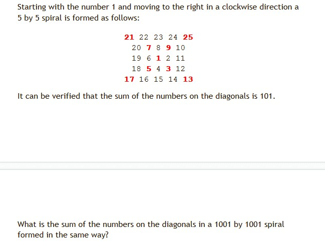

# 1. continue和break语句

1. 学会使用debug - 调试代码的 - 单步调试

2. continue - 跳过本轮循环,但是会继续下一轮循环.  continue语句下面是不能够出现代码的.

   continue语句只能出现在循环体中.

3. break - 1.  打破循环,但是只能打破它所在的那一层循环.2. 跳出代码块 - 自命名/switch块

---

自信题 - 输出2~199之间所有的质数/素数,每输出7个换一行.

`质数- 一个数只能由1和它自己本身整除.`

# 2. 三元操作符

1. 表达式?result1:result2

   简单替代if-else使用,表达式为true,则执行result1,否则执行result2

2. 嵌套使用的 - 不推荐使用.

# 3. switch块

隶属条件分支语句.语法如下:

~~~java
switch(变量){
  case 具体值1:
    //代码
    [break;]
  case 具体值2:
     //代码
     [break;]
  ...
  [default:
  	 //代码
     [break;]
  ]
}
~~~

1. 括号中可以允许的类型只能是***byte,short,int,char***,String[jdk7.x],enum(枚举类型,jdk5.x)以及Byte,Short,Integer,Character

2. 括号中的变量的值如何能够匹配某个case后面的具体值,那么则进入到具体的case块中执行

   `case后面的值不能够是表达式,比如n>2,只能是具体的值`

   * 如果case块中存在break语句,执行完毕之后,跳出switch块
   * 如果case块中不存在break语句,则会继续进入到下一个case块,直到遇到break,否则一直走到最后.

3. 匹配不到任何值,则会进入到default,前提是提供了default

   `default块的位置 - 任何位置,推荐放在末尾[break没有必要写]`

4. jdk17对switch语法进行了升级.

---

`能用switch-case解决的一定可以用if-else if-else去解决,后者的语法更加灵活 - 推荐后者的 - 后期代码的维护`

---

# 4. while

和for一样,都是属于***后置循环.***  先判断条件是否成立,成立才会进入到循环体中去执行.

语法

~~~java
while(条件表达式){
 	//循环体 - 条件为true,否则跳出循环
}

while(true){死循环}
~~~

`while循环应用的场景 - 一个业务不知道循环多少次!但是知道循环退出的条件!`

`自信题:给你一个数字,输出它的位数`,比如传入了一个数字435,返回3

`思路: 435/10 = 43 / 10 = 4 / 10 = 0`

# 5. do-while

特点:属于**前置循环**,初始的时候,即使这个条件不成立,也会先进入到循环体中去执行一次.然后再进行条件的判断,成立则继续循环,否则退出.

~~~java
do{
  //循环体...
}while(条件表达式);
~~~

# 6. 循环练习

 

---

# 7. 数组的定义和使用

## 1. 数组的介绍

> 数据结构:数组,链表[单向和双向],树[二叉树,平衡二叉树,b树,b+树,红黑树],图,栈,队列...
>
> 数组是java内存中用来存储一组同一类型的数据的"容器",数组是有序的[允许通过下标进行访问].

> **数组也是属于对象类型** - 数组本身是存在jvm的堆区.

## 2. 定义数组的语法

~~~java
数据类型 变量名 = 初始值;

//注意:元素类型是数组中可以存储的数据的类型 
//允许是基本数据类型以及对象类型(比如String)
元素类型[] 数组对象名 = new 元素类型[数组长度];
或者
元素类型 数组对象名[] = new 元素类型[数组长度];

定义数组必不可少的俩个条件
1. 元素类型 - 决定了数组中可以存储数据的类型.
2. 数组的长度 - 决定了数组中存储数据的个数.
  
//arr这个数组的类型是什么? - int[] - 整数型数组
int[] arr = new int[3];
~~~

## 3. 关于数组的赋值

> 如果仅仅是定义了数组,没有进行赋值的话,那么系统会根据元素类型来给定默认值.
>
> byte,short,int,long 默认值都是0
>
> float,double默认值都是0.0
>
> char默认值是'',boolean默认值是false
>
> ***对象类型默认值全部是null***

1. 先定义数组,然后通过下标一一赋值

   ~~~java
   int[] arr = new int[3];
   arr[0] = 10;
   arr[1] = 20;
   arr[2] = 30;
   
   arr[3] = 50;//编译是Ok的,但是程序现在运行的过程中会抛出异常 - java.lang.ArrayIndexOutOfBoundsException数组下标越界异常
   ~~~

2. 定义数组的时候,立即赋值

   ~~~java
   String[] arr = new String[]{"abc","def","123"};
   或者
   char[] arr = {'a','b','c'};
   ~~~

3. 数组的属性 - length

   ~~~java
   数组对象.length => 获取数组的长度 - 数组中存储的数据的个数
   ~~~

4. 通过普通for循环进行赋值

   ~~~java
   int[] arr = new int[3];
   
   for(int i = 0;i<arr.length;i++){
     arr[i] = (int)(Math.random()*100+1);
   }
   ~~~

5. `通过数组工具类进行赋值`

## 4. 数组的遍历

1. 通过下标一一遍历

   ~~~java
   int[] arr = {1,23,3};
   System.out.println(arr[0]);
   ~~~

2. 通过普通for循环进行获取

   ~~~java
   for(int i = 0;i<arr.length;i++){
     System.out.println(arr[i]);
   }
   ~~~

3. 通过增强for循环 - jdk5.0开始提供的 - **底层是迭代器**

   `只读for`

   ~~~java
   for(元素类型 变量:数组对象名){
     //输出这个变量
     //此处的变量不是下标 - 就是数组中的当前元素
   }
   
   for(int e:arr){
     System.out.println(e);
   }
   ~~~

4. 通过数组工具类进行遍历

   java.util.Arrays - 提供了大量的操作数组的方法.

   static String toString(int[] arr);

5. 自定义数组输出的方式.

---

# 8. 数组的底层

~~~java
int[] arr1 = new int[]{1,2,3};

int[] arr2 = {4,5,6};
~~~

~~~java
package tech.aistar.day04;

import java.util.Arrays;

/**
 * 本来用来演示: 数组在jvm内存中的形式
 *
 * @author success
 * @date 2023/7/20 15:11:02
 */
public class ArrayMemoryDemo {
    public static void main(String[] args) {
        //①通过new关键字,会在堆中开辟一个区域,申请空间
        //②然后给这个对象进行初始化
        //③将这个对象在堆空间中的内存地址赋值给了一个引用变量arr1,然后存储在栈区
        int[] arr1 = {1,2,3};
        System.out.println(arr1);//[I@7ad041f3

        int[] arr2 = {1,2,3};
        System.out.println(arr2);//[I@251a69d7
        //==在java中永远永远比较的值
        System.out.println(arr1 == arr2);//false

        System.out.println(Arrays.equals(arr1,arr2));//true

        //TODO... char类型数组比较特殊一点
        char[] crr = {'a','b','c'};
        System.out.println(crr);//abc
        System.out.println(""+crr);//[C@251a69d7

        System.out.println("====引用和对象之间的关系 - 提前学习 - 种子====");

        //创建了一个数组对象arr3 => 认为arr3是对象的名称   => 这句话是不对的
        //因为arr3仅仅是这个数组对象的引用而已.
        int[] arr3 = {1,2,3};

        //引用和对象之间是一个什么关系呢?
        //引用里面保存的就是对象在堆空间中的内存地址.
        //引用和对象之间的映射关系 - 符合"气球🎈理论"
        //1. 一个引用在某个时刻只能指向一个对象

        //2. 一个对象在某个时刻可以被多个引用指向.
        int[] arr4 = arr3;

        System.out.println("=======垃圾对象 - 没有任何引用指向的对象=========");

        int[] arr5 = {1,2,3};
        //arr5重新赋值了 - null,代表arr5已经不再指向原来的对象{1,2,3}
        //{1,2,3}这对象已经没有任何引用指向了 -> 垃圾对象 => 等待GC回收
        //int[] arr6 = arr5;
        arr5 = null;

        //System.out.println(Arrays.toString(arr6));
    }
}
~~~

# 9. 方法的参数的传递方式

`面试官希望得到的答案`

1. **基本类型采用值传递** - 将变量中保存的基本类型的数据拷贝一份给方法的形参.
2. **对象类型采用地址传递/引用传递** - 将引用变量保存的对象的内存地址拷贝一份给方法的形参.

`字符串String虽然是对象类型,但是具备值传递的特点的`

~~~java
main:
  String s = "good";
  change(s);
  打印s good
    
change:
  s = "test";
  打印s => test
~~~

---

~~~java
public static void main(String[] args){
  String str = new String("good");//对象类型-但是具备值传递的特点的
  
  char[] ch = {'a','b','c'};//对象类型
  
  change(str,ch);
  
  //str=> good
  
  //ch {'g','b','c'}
}

public static void change(String str,char[] ch){
  str = "test ok";
  ch[0] = 'g'
    
  //打印str => "test ok"
    //ch => gbc
}
~~~

---

`最正确的理论 - Java中只有值传递`

---

# 10. 作业

1. while循环实现俩个数的最大公约数.

2. while实现十进制转成二进制,比如5=>101,10=>1010

3. 给定一个数字,然后逆序输出.比如12345,输出54321

4. 双色球案例

   ~~~java
   比如定义一个数组-长度是5.
   然后通过普通for循环对数组进行赋值,值的范围[1,6]之间的随机整数.
   要求是最终的数组中不能出现重复的数据.
   ~~~

---

