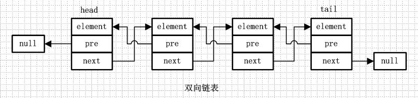

# 1. 集合框架体系

> 功能更加强大的存储数据的"容器"

1. java.util.Collection[I]
   * List[I] - 有序可重复的
     * ArrayList[C] - 和Vector进行对比**,线程不安全.**
     
       底层是动态增长的数组,查询效率高,增删效率低.
     
     * LinkedList[C]
     
       底层是双向链表结构,增删效率高,查询效率低
     
     * Vector[C] - 会和ArrayList对比,使用方式是一样的.**线程安全的**
     
   * Set[I]
     * HashSet[C]
     * SortedSet[I]
       * TreeSet[C]
   
2. java.util.Map[I]
   * HashMap[C]
   * Hashtable[C]
     * Properties[C]

# 1. ArrayList

> 线性的有序的可重复的集合,底层采用的数据结构是**"动态增长"的数组.**
>
> 数组的特点 - 查询效率高,但是***增删***效率低.
>
> `动态增长 - 用到数组的扩容`

## 1. 底层源码add

1. 前奏,初始化一个ArrayList对象的时候,空参构造

   ~~~java
   transient Object[] elementData;//就是用来存储的数据的
   
   //长度为0的数组,已经初始化完毕
   private static final Object[] DEFAULTCAPACITY_EMPTY_ELEMENTDATA = {};
   
   //elementData中的存储的有效数据的个数.
   private int size;
   
   //ArrayList初始化的容量就是10
   private static final int DEFAULT_CAPACITY = 10;
   
   public ArrayList() {
     this.elementData = DEFAULTCAPACITY_EMPTY_ELEMENTDATA;
     //TODO... 存在的问题,此处为什么不直接this.elementData = {}
   }
   ~~~

2. 观察add方法

   ~~~java
   public boolean add(E e) {
     modCount++;//暂时先不管
     
     add(e, elementData, size);
     return true;
   }
   ~~~

   `add(e, elementData, size);底层`

   第一次进入的时候,e添加的数据,elementData指向的是{},并且和DEFAULTCAPACITY_EMPTY_ELEMENTDATA使用==比较,返回true

   size为0

   ~~~java
   private void add(E e, Object[] elementData, int s) {
     		  //第一次进入,s=0,elementData.length也是0,返回true
     
     		  //第二次进入的时候,s=1,elementData.length是10,不会扩容
     
     	    //到达扩容临界点 s和数组长度都是10
           if (s == elementData.length)
               //第一次就会扩容
               elementData = grow();
           elementData[s] = e;
           size = s + 1;
       }
   ~~~

   `研究扩容方法grow()`

   ~~~java
   private Object[] grow() {
     //第一次进入,size=0
     
     //扩容临界点grow(10+1)
     return grow(size + 1);
   }
   ~~~

   `grow(size+1)`

   ~~~java
   第一次进入 - grow(1)
     
   扩容临界点grow(11)
   
   private Object[] grow(int minCapacity) {
     //第一次进入,oldCapacity=0
     
     //临界点 oldCapacity=10
     int oldCapacity = elementData.length;
     //第一次进入,if返回false
     if (oldCapacity > 0 || elementData != DEFAULTCAPACITY_EMPTY_ELEMENTDATA) {
       int newCapacity = ArraysSupport.newLength(oldCapacity,
                                                 minCapacity - oldCapacity, /* minimum growth */
                                                 oldCapacity >> 1           /* preferred growth */);
       //jdk8 newCapacity = oldCapacity + oldCapacity>>1
       //扩容倍数1.5倍进行扩容
       return elementData = Arrays.copyOf(elementData, newCapacity);
     } else {
       //第一次进入,执行此处
       //elementData = new Object[10];
       return elementData = new Object[Math.max(DEFAULT_CAPACITY, minCapacity)];
     }
   }
   ~~~

## 2. 总结扩容机制

1. 第一次添加数据的时候,第一次调用add方法的时候,才会进行扩容操作.刚new的时候,是不会的
2. 扩容的倍数 - 1.5倍

## 3. 集合迭代器

作用 - 为访问不同的集合,提供的一种统一的方式.  

不同的集合底层的数据结构是不一样的

无论是迭代器还是增强for循环,这两种方式都是属于只读的方式.在遍历集合的时候,不能够修改集合.

## 4. 只读循环错误原因

> ~~~java
>  public static void delByPrice3(List<Book> list,double price){
>    Iterator<Book> iter = list.iterator();
>    while(iter.hasNext()){
>      Book b = iter.next();
>      if(b.getPrice()<=price){
>        list.remove(b);
>      }
>    }
>  }
> ~~~
>
> ~~~java
>  public static void delByPrice4(List<Book> list,double price){
>    for (Book b : list) {
>      if(b.getPrice()<=price){
>        list.remove(b);
>      }
>    }
>  }
> ~~~
>
> `java.util.ConcurrentModificationException并发修改异常`

---

> ~~~java
> ArrayList.java
> protected transient int modCount = 0;
> public boolean add(E e) {
>   //只要调用add方法,那么modCount一直自增
>   modCount++;
>   add(e, elementData, size);
>   return true;
> }
> 
> list.remove(b)的时候,会最终走到此处
>  private void fastRemove(Object[] es, int i) {
>         modCount++;
>         final int newSize;
>         if ((newSize = size - 1) > i)
>             System.arraycopy(es, i + 1, es, i, newSize - i);
>         es[size = newSize] = null;
>     }
> ~~~
>
> `无论是add还是remove,modCount都会自增`
>
> 研究next方法
>
> ~~~java
> public E next() {
>   checkForComodification();
>   int i = cursor;
>   if (i >= size)
>     throw new NoSuchElementException();
>   Object[] elementData = ArrayList.this.elementData;
>   if (i >= elementData.length)
>     throw new ConcurrentModificationException();
>   cursor = i + 1;
>   return (E) elementData[lastRet = i];
> }
> ~~~
>
> `继续看 checkForComodification();`
>
> ~~~java
> int expectedModCount = modCount;
> 
> final void checkForComodification() {
>    if (modCount != expectedModCount)
>      throw new ConcurrentModificationException();
>  }
> ~~~

# 2. LinkedList

> jdk8及其以后用的是双向链表结构
>
> 链表结构和数据结构进行对比
>
> 1. 内存占用方面=>链表的结构会占用更多的内存,链表的节点除了需要保存element,还需要保存地址
>
> 2. 效率方面 - 如果链表结构在中间位置添加数据,只涉及到相邻节点.ArrayList在中间添加数据,涉及到数组元素的移动.
>
>    一般说"链表的增删效率高于ArrayList"
>
>    ArrayList查询效率必然高于LinkedList

## 1. 链表结构

单向链表特点

1. 每个节点保存的是element和next{下一个节点的地址}
2. 最后一个节点的next指向null
3. 第一个节点 - 头节点,最后一个节点 - 尾结点

 

---

 

单向循环链表特点:

1. 尾节点的next指向头节点

---

 

`双向链表 - 本次课程中LinkedList底层采用的数据结构`

1. 每个节点由element,next,pre(上一个节点的地址)
2. 头结点的pre指向null
3. 尾节点指向null

---

 

双向循环链表

1. 头节点的pre指向尾结点
2. 尾结点的next指向头节点

## 2. add方法剖析

~~~java
public boolean add(E e) {
  linkLast(e);
  return true;
}
~~~

`观察add`

~~~java
private static class Node<E> {
  E item;//链表节点中存储的真实的元素element
  Node<E> next;//下一个节点的地址
  Node<E> prev;//上一个节点的地址

  Node(Node<E> prev, E element, Node<E> next) {
    this.item = element;
    this.next = next;
    this.prev = prev;
  }
}
~~~

~~~java
transient Node<E> last;

void linkLast(E e) {
  //首次add方法 l = last = null;
  final Node<E> l = last;
  //首次执行 new Node<>(null,e,null);
  final Node<E> newNode = new Node<>(l, e, null);
  //新增的节点就是作为最后一个节点
  last = newNode;
  if (l == null)
    //第一次执行,当前的节点也是头节点,总结:只有一个节点的时候,既是尾节点,也是头节点
    first = newNode;
  else
    //原来最后一个节点的next指向现在新增的这个节点
    l.next = newNode;
  
  size++;//集合中元素的个数
  modCount++;//不允许并发修改.
}
~~~

## 3. remove(int index)方法

~~~java
public E remove(int index) {
  checkElementIndex(index);
  return unlink(node(index));
}
~~~

~~~java
E unlink(Node<E> x) {//x代表index位置的那个node节点
  // assert x != null;
  final E element = x.item; // 即将删除的那个节点的数据
  
  final Node<E> next = x.next;//即将删除的那个节点的下一个节点
  final Node<E> prev = x.prev;//即将删除的那个节点的上一个节点

  if (prev == null) {//判断x是否为第一个节点
    first = next;//把x后面的节点设置第一个节点
  } else {
    //x不是头节点
    prev.next = next;//把x的左边的节点的next指向x后边的那个节点
    x.prev = null;//释放内存.
  }

  if (next == null) {//判断是否为尾节点
    last = prev;//把原来倒数第二个节点设置成尾结点
  } else {
    //不是尾节点
    //原来x的右边的节点的pre指向x的左边的节点
    next.prev = prev;
    //释放内存
    x.next = null;
  }
  //释放内存
  x.item = null;
  size--;
  modCount++;
  //返回被删除的元素
  return element;
}
~~~

## 4. get(int index)

~~~java
public E get(int index) {
  checkElementIndex(index);
  return node(index).item;
}
~~~

~~~java
// 1 2 3 45  67 8 9
//index=4
//size=7
Node<E> node(int index) {
  // 链表从中间的位置一分为2
  if (index < (size >> 1)) {//index<3
    //链表左边的 - 肯定是从头节点
    Node<E> x = first;
    for (int i = 0; i < index; i++)
      x = x.next;//x-z3
    return x;
  } else {//index>=3
    //链表右边的 - 肯定是从尾节点
    Node<E> x = last;
    for (int i = size - 1; i > index; i--)
      x = x.prev;//x-d3
    return x;
  }
}
~~~

# 3. 作业布置

1. 括号匹配

   ~~~java
   思路:
   String s = "[({})]";
   char[] arr = s.toCharArray();//字符串转换成字符数组.
   
   LinkedList<Character> list = new ....
     
   //1. 将arr中的第一个元素压栈
   list.push(arr[0]);
   //2. 从arr的第二个元素开始遍历
   当前的符号和栈顶进行比较->不符合继续压栈
   如果一样=>弹出栈顶元素pop()
   
   
   栈
     
   isEmpty() => true 匹配的
   ~~~

2. 条形码 

    

# 4. ArrayList和LinkedList的区别⭐️

> 1.  ArrayList的实现是基于**数组**，LinkedList的实现是基于**双向链表**。
> 1.  对于**随机访问**，**ArrayList优于LinkedLis**t，ArrayList可以根据下标以O(1)时间复杂度对元素进行随机访问。而LinkedList的每一个元素都依靠地址指针和它后一个元素连接在一起，在这种情况下，查找某个元素的时间复杂度是O(n)
> 1.  对于**插入和删除操作**，**LinkedList优于ArrayList**，因为当元素被添加到LinkedList任意位置的时候，不需要像ArrayList那样重新计算大小或者是更新索引。
> 1.  **LinkedList比ArrayList更占内存**，因为LinkedList的节点除了存储数据，还存储了两个引用，一个指向前一个元素，一个指向后一个元素。

# 5. ArrayList和Vector的区别⭐️

> `相同点`
>
> * 这两个类都实现了List接口（List接口继承了Collection接口），他们都是**有序集合**，即存储在这两个集合中的元素的位置都是有顺序的，相当于一种动态的数组，我们以后可以按位置索引号取出某个元素，，并且其中的**数据是允许重复**的
>
> `不同点`
>
> * **Vector是线程安全的**，也就是说是它的方法之间是线程同步的，而**ArrayList是线程序不安全的**，它的方法之间是线程不同步的。如果只有一个线程会访问到集合，那最好是使用**ArrayList，因为它不考虑线程安全，效率会高些**；如果有多个线程会访问到集合，那最好是使用Vector，因为不需要我们自己再去考虑和编写线程安全的代码。
> * ArrayList与Vector都可以设置初始的空间大小，**Vector还可以设置增长的空间大小**，而ArrayList没有提供设置增长空间的方法。即Vector增长原来的一倍(扩容默认是2倍)，ArrayList增加原来的0.5倍(扩容是1.5倍)。