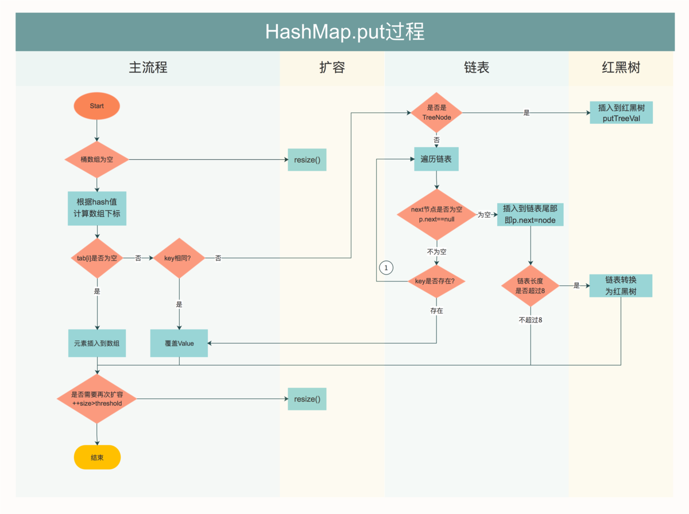

# 1. HashMap集合

特点:

1. 采用key-value键值对的形式来存储数据
2. key只能是对象类型,一般推荐使用包装类型.
3. 针对key是无序不可重复的.但是value是允许重复的
4. 如果后面的key和前面的key发生冲突了,那么后面的value会覆盖前面的value.

底层数据结构

jdk8.0 => 桶数组+单向链表 + 红黑树

jdk7.0 => 数组+链表

---

## 1. put方法流程

1. 初始化一个HashMap,构造函数

   ~~~java
   public HashMap() {
     //loadFactor - 扩容因子,默认值就是0.75f
     this.loadFactor = DEFAULT_LOAD_FACTOR; // all other fields defaulted
   }
   ~~~

2. put方法的底层

   ~~~java
    public V put(K key, V value) {
      return putVal(hash(key), key, value, false, true);
    }
   ~~~

   `hash(key) - 哈希的扰动函数`

   ~~~java
   static final int hash(Object key) {
     int h;
     return (key == null) ? 0 : (h = key.hashCode()) ^ (h >>> 16);
   }
   ~~~

3. putVal方法

   ~~~java
    static class Node<K,V> implements Map.Entry<K,V> {
           final int hash;
           final K key;
           V value;
           Node<K,V> next;
    }
   ~~~

   

   ~~~java
   transient Node<K,V>[] table;//属性才有默认值的概念,就是为null
   
   final V putVal(int hash, K key, V value, boolean onlyIfAbsent,
                      boolean evict) {
           Node<K,V>[] tab; Node<K,V> p; int n, i;
     
           if ((tab = table) == null || (n = tab.length) == 0)
             //n=16
             //resize() - Node<K,V>[] newTab = (Node<K,V>[])new Node[16];
             n = (tab = resize()).length;
     //tab[key哈希值得到的下标],第一次进入肯定为null
     //(n-1) & hash => 取模
     if ((p = tab[i = (n - 1) & hash]) == null)
       //桶数组 - 哈希桶 - 根据hash算法得到的位置.
       //数组中放入到就是Node节点
       tab[i] = newNode(hash, key, value, null);
     else {
       //产生了哈希冲突
       Node<K,V> e; K k;
       //p是这个数组中已经存在的
       //hash一样的时候,还不能说明俩个key是同一个对象,还需要进一步比较equals
       if (p.hash == hash &&
           ((k = p.key) == key || (key != null && key.equals(k))))
         //e = p = 旧节点
         e = p;
       else if (p instanceof TreeNode)
         e = ((TreeNode<K,V>)p).putTreeVal(this, tab, hash, key, value);
       else {
         //hash虽然冲突了,但不是同一个对象.
   
         for (int binCount = 0; ; ++binCount) {
           //冲突位置上第一个值
           if ((e = p.next) == null) {
             //形成一个单向链表
             p.next = newNode(hash, key, value, null);
             
             //当链表的长度大于8的时候并且数组的容量开始大于64的时候,链表结构开始转成红黑树的结构
             //如果链表长度小于等于6的时候,树变成链表结构
             if (binCount >= TREEIFY_THRESHOLD - 1) // -1 for 1st
               treeifyBin(tab, hash);
             break;
           }
           if (e.hash == hash &&
               ((k = e.key) == key || (key != null && key.equals(k))))
             break;
           p = e;
         }
       }
       if (e != null) { // existing mapping for key
         //oldValue - 是旧位置上的那个value值
         V oldValue = e.value;
         if (!onlyIfAbsent || oldValue == null)
           //将新的value覆盖旧位置[哈希产生冲突位置]上的value
             value;
         afterNodeAccess(e);
         return oldValue;
       }
     }
     ++modCount;
     //集合中数据的个数是否到达扩容阀值
     if (++size > threshold)
       resize();
     afterNodeInsertion(evict);
     return null;
   }
   ~~~

## 2. map集合的扩容机制resize()

~~~java
final Node<K,V>[] resize() {
  Node<K,V>[] oldTab = table;
  //oldCap = 0
  int oldCap = (oldTab == null) ? 0 : oldTab.length;
  //oldThr = threshold => 扩容阀值
  //(capacity * load factor).
  int oldThr = threshold;//oldThr = 0
  int newCap, newThr = 0;
  if (oldCap > 0) {
    if (oldCap >= MAXIMUM_CAPACITY) {
      threshold = Integer.MAX_VALUE;
      return oldTab;
    }
    else if ((newCap = oldCap << 1) < MAXIMUM_CAPACITY &&
             oldCap >= DEFAULT_INITIAL_CAPACITY)
      newThr = oldThr << 1; // double threshold
  }
  else if (oldThr > 0) // initial capacity was placed in threshold
    newCap = oldThr;
  else {               // zero initial threshold signifies using defaults
    //newCap=16
    newCap = DEFAULT_INITIAL_CAPACITY;
    newThr = (int)(DEFAULT_LOAD_FACTOR * DEFAULT_INITIAL_CAPACITY);
  }
  if (newThr == 0) {
    float ft = (float)newCap * loadFactor;
    newThr = (newCap < MAXIMUM_CAPACITY && ft < (float)MAXIMUM_CAPACITY ?
              (int)ft : Integer.MAX_VALUE);
  }
  threshold = newThr;
  @SuppressWarnings({"rawtypes","unchecked"})
  //初始化了一个长度为16的数组
  Node<K,V>[] newTab = (Node<K,V>[])new Node[newCap];
  table = newTab;
  if (oldTab != null) {
    for (int j = 0; j < oldCap; ++j) {
      Node<K,V> e;
      if ((e = oldTab[j]) != null) {
        oldTab[j] = null;
        if (e.next == null)
          newTab[e.hash & (newCap - 1)] = e;
        else if (e instanceof TreeNode)
          ((TreeNode<K,V>)e).split(this, newTab, j, oldCap);
        else { // preserve order
          Node<K,V> loHead = null, loTail = null;
          Node<K,V> hiHead = null, hiTail = null;
          Node<K,V> next;
          do {
            next = e.next;
            if ((e.hash & oldCap) == 0) {
              if (loTail == null)
                loHead = e;
              else
                loTail.next = e;
              loTail = e;
            }
            else {
              if (hiTail == null)
                hiHead = e;
              else
                hiTail.next = e;
              hiTail = e;
            }
          } while ((e = next) != null);
          if (loTail != null) {
            loTail.next = null;
            newTab[j] = loHead;
          }
          if (hiTail != null) {
            hiTail.next = null;
            newTab[j + oldCap] = hiHead;
          }
        }
      }
    }
  }
  return newTab;
}
~~~

## 3. put流程图

 

---

# 2. 作业布置

~~~java
public class Purcase{ //购买类
	private String brand; //品牌
	private String name; //产品名
	private double cost; // 费用

	//构造,getter/setter,toString...
}

List<Purcase> list = new ArrayList<>();

Purcase p1 = new Purcase("宝洁","洗手粉",18.5);
Purcase p2 = new Purcase("联合利华","肥皂",4.5);
Purcase p3 = new Purcase("宝洁","牙膏",32.5);
Purcase p4 = new Purcase("宝洁","毛巾",14.5);
Purcase p5 = new Purcase("洁利","洗面奶",26.0);
Purcase p6 = new Purcase("好迪","洗发水",27.5);
Purcase p7 = new Purcase("多芬","沐浴露",38.5);
Purcase p8 = new Purcase("宝洁","洗洁精",3.4);

list.add(p1);
list.add(p2);
....

要求:写一个程序,打印出各品牌所花费的总费用①       =>   分类统计
    排好序后再打印输出,按花费总费用的降序排序②    =>   排序
~~~

---

