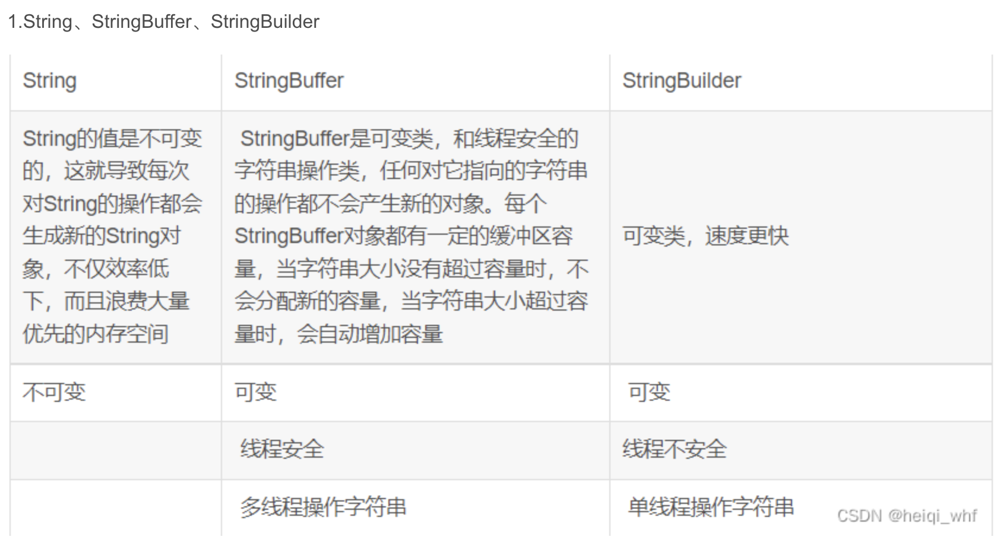
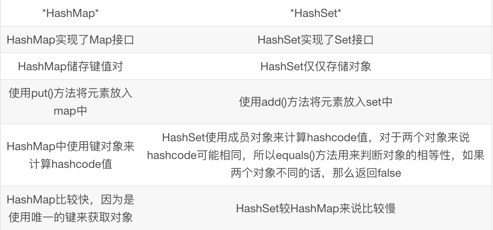

# 1. 关于集合的排序方式

1. 比较器的接口 - java.util.Comparator<T> - 函数式接口

   ~~~java
   //        list.sort(new Comparator<Purcase>() {
   //            @Override
   //            public int compare(Purcase o1, Purcase o2) {
   //                return (int) (o1.getCost()-o2.getCost());
   //            }
   //        });
   
           list.sort((o1,o2)-> (int) (o1.getCost()-o2.getCost()));
   ~~~

2. 可比较接口 java.lang.Comparable

   * 实体类需要实现这个接口
   * 还需要实现方法compareTo

   `配合java.util.Collections中的sort(List list)方法一起使用`

# 2. Collection和Collections的区别

> Collection - 是List和Set集合的顶级的接口
>
> Collections - 集合工具类,提供了一些操作集合的方法,比如排序,反转

---

# 3. JDK8.x新特性Stream

> 流式操作我们的集合 - 更高效
>
> 1. distinct
> 2. filter

---

# 4. HashMap总结

1. resize方法总结

   - capacity 即容量，默认16。
   - loadFactor 加载因子，默认是0.75
   - threshold 阈值。阈值=容量*加载因子。默认12。当元素数量超过阈值时便会触发扩容。

2. hashmap扩容倍数

   容量变为原来的2倍，阈值也变为原来的2倍,loadFactor永远是0.75

3. 扩容因子为什么是0.75

   **加载因子**是表示Hsah表中元素的填满的程度。 加载因子越大,填满的元素越多,空间利用率越高，

   但冲突的机会加大了。 反之,加载因子越小,填满的元素越少,冲突的机会减小,但空间浪费多了。

   冲突的机会越大,则查找的成本越高。反之,查找的成本越小。

   因此,必须在 "冲突的机会"与"空间利用率"之间寻找一种平衡与折衷。

4. 插入节点的时候,当链表的长度大于8并且桶数组的长度大于64的时候,那么链表才会转换成红黑树的结构

   当进行删除节点的时候,节点个数如果小于6的时候,红黑树自动转换成链表

# 5. 字符串区别

 

# 6. HashSet集合

## 1. HashSet添加数据的原理

1. 将数据提交到容器之前,会先调用对象的hashCode方法,得到一个哈希值.

2. 如果这个哈希值在这之前没有出现过,说明这个位置没有被占用,直接将这个元素放入到这个位置

   p = tab[(n-1)&hash]

3. 如果这个哈希值之前出现过.但是此时还不能说明哈希冲突/碰撞的俩个元素一定是同一个元素,

   还需要进一步去比较equals方法

4. 如果equals仍然返回true,则拒绝添加.

## 2. 底层代码

HashSet底层是HashMap.

~~~java
public HashSet() {
   map = new HashMap<>();
 }
~~~

add方法

~~~java
private static final Object PRESENT = new Object();

//HashSet的值 = Map集合的key
public boolean add(E e) {
  return map.put(e, PRESENT)==null;
}
~~~

~~~java
public V put(K key, V value) {
  return putVal(hash(key), key, value, false, true);
}
~~~

## 3. 对比

HashSet和HashMap区别

 

---

# 7. TreeSet

> 属于Set[I] - SortedSet[I] - TreeSet[C]
>
> 配合比较器接口/可比较接口来实现set集合的排序.但是仍然是不可重复的.

---

使用方式

1. 直接使用TreeSet的空参构造,那么调用add方法之前,容器的对象必须要先实现java.lang.Comparable接口,否则会抛出java.lang.ClassCastException

2. 带参构造 - 直接传比较器接口

   ~~~java
   TreeSet<PurcaseX> set = new TreeSet<>(
     (o1,o2)-> (int) (o2.getTotal()-o1.getTotal())
   );
   ~~~

---

## 1. TreeSet和HashSet区别

> treeset不允许存储null值,hashset可以存储一个null值

1. 不同点1：底层使用的储存数据结构不同

   hashset底层使用的是hashmap哈希表结构存储 - 实际是桶数组+单向链表+红黑树

   TreeSet底层用的是TreeMap树结构(自平衡的二叉树)存储 

   `红黑树的前身 - 平衡二叉B树 - 接近平衡的二叉树,不是绝对平衡`

2. 存储的数据这个唯一方式不同

   hashset是通过重写equals和hashcode来保证的

   treeset是通过比较器接口或者可比较接口compareTo方法来保证的

3. hashset是无序的,treeset是有序的

4. 存储原理

   hashset添加数据的原理在上面

   treeset底层是一个二叉树,可以对set集合中的元素进行排序,这种结构,可以提高排序性能,根据比较返回值来决定,只要返回0,代表元素重复.

---

# 8. Properties

> 它是.properties文件在内存中映射的那个对象.存储的格式也是key-value
>
> ~~~java
> package tech.aistar.day15.prop;
> 
> import java.io.IOException;
> import java.io.InputStream;
> import java.util.Properties;
> 
> /**
>  * 本来用来演示: java.util.Properties
>  *
>  * @author success
>  * @date 2023/8/4 14:41:27
>  */
> public class PropDemo {
>     //叫做属性文件在内存中的表现形式的对象.
>     public static Properties prop = new Properties();
>     //通过静态代码块来读取资源配置文件
>     static{
>         //1.获取属性文件的字节输入流
>         InputStream in = PropDemo.class.getResourceAsStream("/tech/aistar/day15/prop/db.properties");
>        //2. 加载输入流
>         try {
>             prop.load(in);
>         } catch (IOException e) {
>             throw new RuntimeException(e);
>         }
>     }
> 
>     public static void main(String[] args) {
>         //根据key获取
>         String username = prop.getProperty("username");
>         String age = prop.getProperty("age");
>         System.out.println(username);
>         System.out.println(age);
>     }
> }
> ~~~

---

# 9. HashMap和Hashtable的区别

1. 都是属于Map接口下的,HashMap继承AbstractMap[C],Hashtable继承Dictionary[C]

2. Hashtable是线程安全的,HashMap是线程不安全的.

3. HashMap底层用到了红黑树,Hashtable没有用到红黑树

4. HashMap的key-value允许的形式, null-value,key-null,null-null,key-value

   Hashtable的key-value都不允许为null

5. 放入数据的时候key值的hashCode的计算方式是不一样的.

   hashmap用的自实现的hashcode

6. HashMap中没有contains方法=>分成了来个containsKey以及containsValue

   hashtable只有contains方法

---

# 10. 泛型(generic)

## 1. 概念

1. 泛型的本质就是类型的参数化,把类型当成参数进行传递
2. 从jdk5.0开始引入泛型,至此,集合都是类型安全的集合.
3. 泛型只能使用对象类型

## 2. 泛型符号

1. T - 类型
2. K,V  -减值
3. E - 元素
4. N - 数字
5. ? - 通配符

## 3. 指定泛型上限和下限

1. ? super T

   指定下限

   传入的类型只能是T类型或者是T类型的父类型

2. ? extends T 

   指定上限

   传入的类型只能是T类型或者T类型的子类型

## 4. 泛型的有效期

泛型只能在编译期间有效,在运行期间是无效的,在运行期间会被擦除.并且泛型是没有多态的.

## 5. 泛型的好处

1. 保证代码的健壮性
2. 避免强制类型的转换,从而代码的简洁

## 6. 泛型的应用

泛型类,泛型接口,泛型方法,泛型的参数,泛型的继承

1. 泛型类 - 如果大部分方法都需要这个泛型
2. 泛型方法 - 类不需要定义成泛型类,个别的方法需要单独定义成泛型方法
3. 静态方法,泛型必须定义成泛型方法.

## 7. 泛型的继承

1. 子类指明确定的类型
2. 子类没有明确确定的类型

~~~java
package tech.aistar.day15.generic;

import tech.aistar.day15.PurcaseX;

/**
 * 本来用来演示: 泛型的继承
 *
 * @author success
 * @date 2023/8/4 16:34:44
 */
public class Sup01<T> {
    public void add(T t){
        System.out.println(t);
    }
}
//子类不指定确定的类型
class Sub01<T> extends Sup01<T>{
    @Override
    public void add(T t) {
        System.out.println("sub01-"+t);
    }
}
//子类指定确定的类型
class Sub02<T> extends Sup01<PurcaseX>{
    @Override
    public void add(PurcaseX purcaseX) {
        System.out.println("sub02-"+purcaseX);
    }
}
class Sup01Test{
    public static void main(String[] args) {
        Sup01<String> s = new Sub01<>();
        s.add("ok");

        Sup01<PurcaseX> s1 = new Sub02<>();
       
        s1.add(new PurcaseX("saa",100.0d));
    }
}
~~~

## 8. 泛型开发中的实际应用

1. hibernate框架

   ~~~java
   //1. 获取连接
   Session session = sessionFactory.openSession();
   //2. 开启事务
   Transaction tx = session.beginTransaction;
   //3. 调用session的api方法
   session.save(user对象);
   //4. 提交事务
   tx.commit();
   //5. 关闭连接
   session.close();
   ~~~

   ~~~java
   public interface IStudentDao{
     void save(Student s);
     
     //List<Student> findAll(); 
   }
   ~~~

   ~~~java
   public interface ITeacherDao{
     void save(Teacher t);
     
      //List<Teacher> findAll(); 
   }
   ~~~

2. 泛型登场 - 设计

   1. 定义一个顶级的接口

      ~~~java
      public interface IBaseDao<T> {
          void save(T t);
      }
      ~~~

   2. 顶级的接口的实现类

      ~~~java
      package tech.aistar.day15.devs;
      
      /**
       * 本来用来演示:
       *
       * @author success
       * @date 2023/8/4 16:51:20
       */
      public class BaseDaoImpl<T> implements IBaseDao<T> {
          @Override
          public void save(T t) {
              //1. 获取连接
              //        Session session = sessionFactory.openSession();
              ////2. 开启事务
              //        Transaction tx = session.beginTransaction;
              ////3. 调用session的api方法
              //        session.save(user对象);
              ////4. 提交事务
              //        tx.commit();
              ////5. 关闭连接
              //        session.close();
      
              System.out.println("1.获取连接");
              System.out.println("2.开启事务");
      
              System.out.println("保存:"+t);
      
              System.out.println("4. 提交事务");
              System.out.println("5. 关闭事务");
          }
      }
      ~~~

   3. IUserDao

      ~~~java
      public interface IUserDao extends IBaseDao<User>{
          //自己特有的
      }
      ~~~

   4. UserDaoImpl

      ~~~java
      public class UserDaoImpl extends BaseDaoImpl<User> implements IUserDao{
          
      }
      ~~~

   5. 测试

      ~~~java
      package tech.aistar.day15.devs;
      
      /**
       * 本来用来演示:
       *
       * @author success
       * @date 2023/8/4 16:56:38
       */
      public class UserDaoTest {
          public static void main(String[] args) {
              IUserDao userDao = new UserDaoImpl();
      
              User user = new User();
              userDao.save(user);
          }
      }
      ~~~

      
